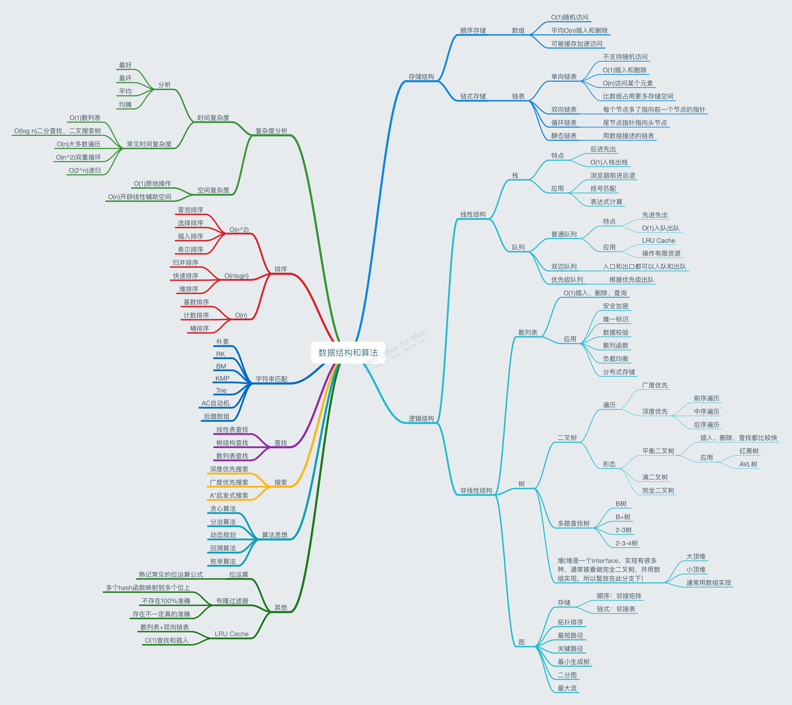
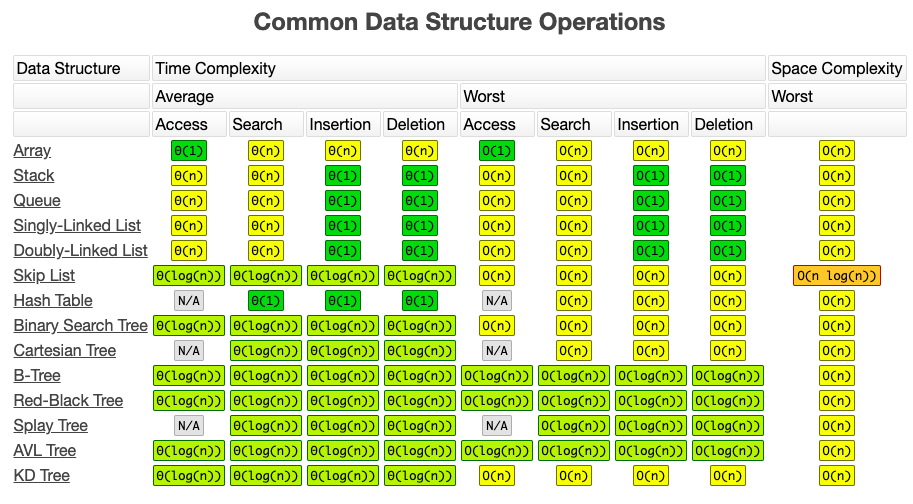
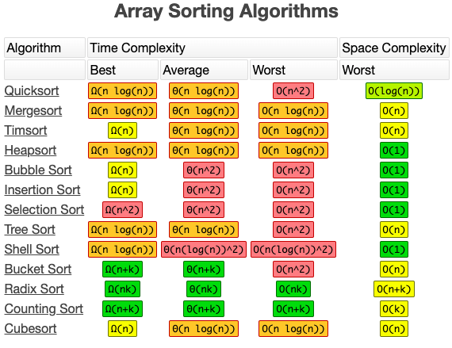
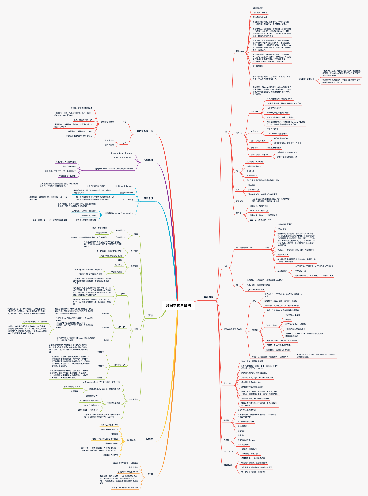

# 期末总结

想不到这么快就已经结束了，回过头来思考一下，感觉自己的基础确实扎实了好多，从基本的数据结构到各种算法思想，虽然有部分只是略过，但是算法的本质已经铭记于心。截止期末，LeetCode的题目已经打卡完成了150道，算是这几年来做得最多最持久的一次了，在这里，要感谢极客时间的各位老师和助教们。当然，有了量变，肯定也会产生质变。经过这两个多月的坚持，目前LeetCode上简单和中等的题目我大都能靠自己独立做出来，部分题目还能做到举一反三，不过困难的目前还比较勉强，但是我会继续坚持下去，直到完全攻克算法。另外，除了刷题之外，我目前在工作中也在使用链表、小顶堆、排序、贪心、递归等超哥在课上讲过的内容，个人编码能力也有了很大的提升。

下面，我就简单提纲挈领的罗列一下这门课的主要内容吧，算是一个回顾，根据这些标题，能回忆对应的内容。不过，在此之前，先贴一张超哥给的思维导图，这里罗列的要比我总结的更加清晰一些。

## 关于做题

- 五毒神掌：
  1. 会做就做，不会做就直接看题解，通过题解弄懂，或者实在不懂死记硬背也行，然后自己默写一遍；
  2. 第二天再做一遍；
  3. 一周后再做一遍；
  4. 一个月后再做一遍；
  5. 在面试前，再把这些题目拿出来过一遍。
- 学会计算时间空间复杂度
- 学会利用空间换时间
- 学会自顶向下的编程思维
- 学会寻找重复子问题

## 数据结构

1. 数组
2. 链表
   - 单链表
     - 链表反转
     - K个一组反转链表
     - 链表环的检测
     - 两个有序链表的合并
     - 删除链表倒数第n个节点
   - 双向链表
   - 循环链表
3. 跳表
4. 栈
   - 单调栈的应用（接雨水）
5. 队列
   - 优先队列（堆）
   - 双端队列
   - 循环队列
6. 树
   - 二叉树、多叉树
     - 前序、中序、后序、层序遍历
   - 二叉搜索树
     - 中序遍历是递增序列
     - 左右子树都是二叉搜索树
   - 堆
     - 大顶堆
     - 小顶堆
   - 字典树（前缀树）
   - 平衡二叉查找树（AVL、2-3树、红黑树）
   - B树、B+树
7. 图
   - 广度优先搜索（BFS、队列实现）
   - 深度优先搜索（DFS、递归实现）

这里给一张各个算法的访问、查询、插入、删除的最坏、平均时间复杂度的总结图。

## 算法思想

1. 递归算法

   - 拒绝人肉递归
   - 寻找最近重复子问题，只需关心当前层的逻辑，然后不断下探
   - 利用数学归纳法

2. 分治、回溯算法

3. 贪心算法

   - 一种在每一步选择中都采取在当下状态下最好或最优的选择，从而希望导致结果是全局最好或最优的算法；与动态规划的不同在于它对每个子问题的解决方案都做出选择，不能回退何种情况下可以使用贪心算法
   - 典型例题：
     - 跳跃游戏一、二
     - 分发饼干

4. 动态规划

   - 寻找最优子结构 opt[n] = best_of(opt[n-1],opt[n-2],...)
   - 存储中间状态:opt[i]
   - 递推公式 (美其名曰：状态转移方程或者DP方程)

5. 排序算法

   

6. 二分查找

   - 关键：注意`mid` 加一还是减一，while 里到底用 `<=` 还是 `<`。注意细节！

   - https://labuladong.gitbook.io/algo/di-ling-zhang-bi-du-xi-lie/er-fen-cha-zhao-xiang-jie
   - 关键例题：
     - [搜索旋转排序数组](https://leetcode-cn.com/problems/search-in-rotated-sorted-array/)
     - [寻找旋转排序数组中的最小值](https://leetcode-cn.com/problems/find-minimum-in-rotated-sorted-array/)

7. 搜索算法

   - 广度优先搜索`BFS`
   - 深度优先搜索`DFS`
   - 双向广度优先搜索
   - A*搜索算法

8. 位运算

   - 左移 <<
   - 右移 >>
   - 按位与 &
   - 按位或 |
   - 按位取反 ~
   - 按位异或 ^
   - **N&N-1   、  N&~N   、  N&-N**
   - 典型例题
     - n皇后
     - 统计二进制位
     - 快速幂

9. 字符串查找算法

   - 暴力法 - O(MN)
   - Rabin-Karp 算法
   - KMP 算法
   - Boyer-Moore 算法
   - Sunday 算法

## 其他数据结构

1. 哈希表
2. 并查集
3. 布隆过滤器
   - 多个hash函数映射到多个位上
   - 如果不存在，100%不存在
   - 如果存在，那不一定存在
4. LRU Cache
   - 散列表+双向链表

## 思维图

当然，上面的总结也只是一个提纲，真正有用的，是自己形成的知识体系。思维导图算是一个比较好的呈现形式，这里列一个简单的思维导图，方便之后更加详细的回顾。

